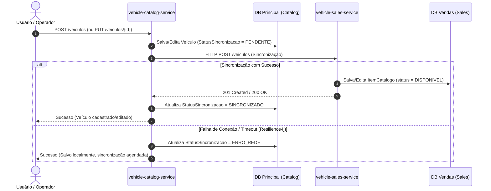
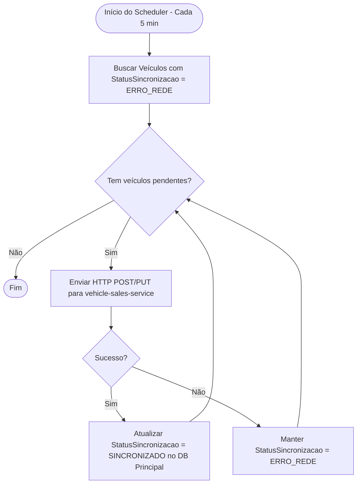
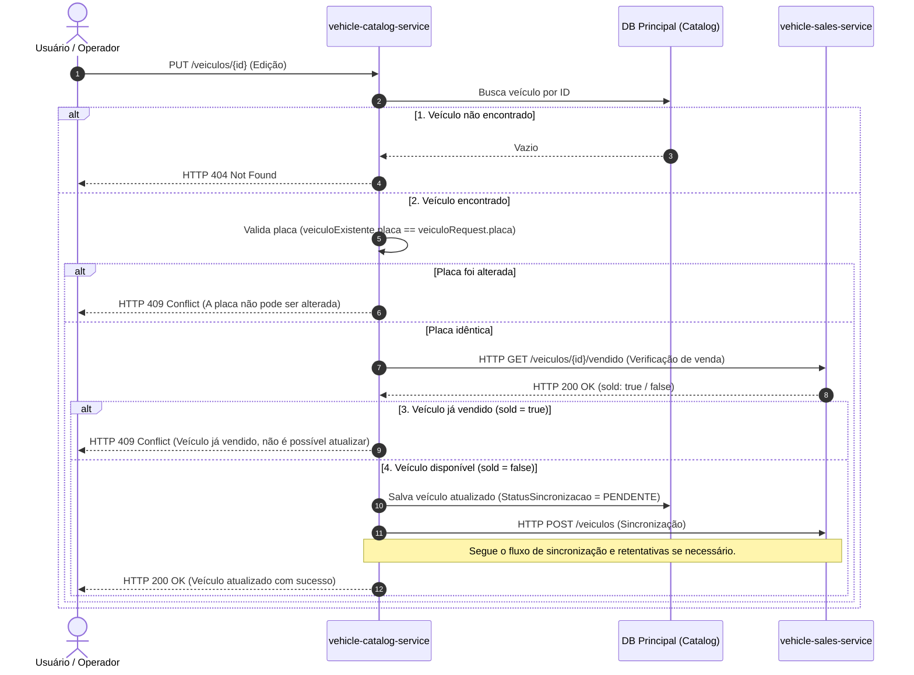
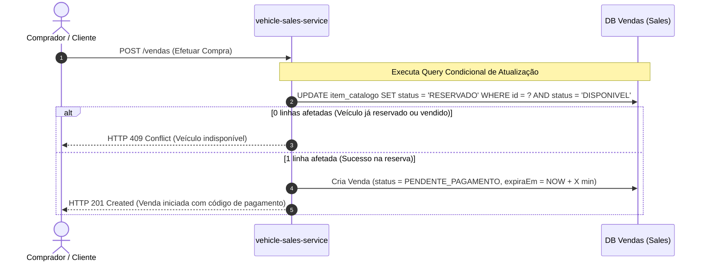
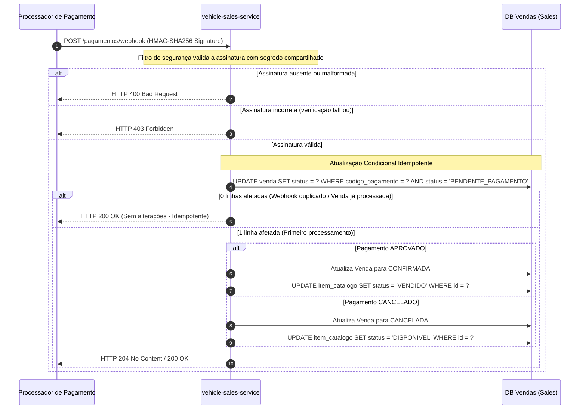
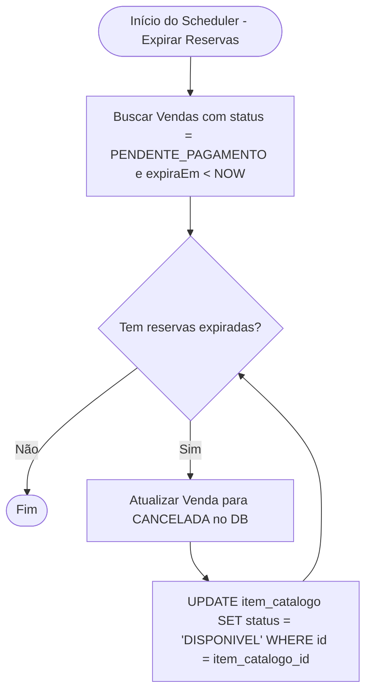

# Catalogo Veiculo Service

Microsserviço responsável pelo gerenciamento do catálogo de veículos da plataforma de revenda automotiva. Faz parte de uma arquitetura de dois serviços, sendo o **software principal** responsável pelo cadastro, edição e publicação da infraestrutura completa via Kubernetes.

---

## Sumário

- [Visão geral](#visão-geral)
- [Arquitetura](#arquitetura)
- [Pré-requisitos](#pré-requisitos)
- [Como rodar localmente (sem Kubernetes)](#como-rodar-localmente-sem-kubernetes)
- [Como rodar com Kubernetes + Floci (simulando AWS)](#como-rodar-com-kubernetes--floci-simulando-aws)
- [Como executar os testes](#como-executar-os-testes)
- [Documentação da API](#documentação-da-api)
- [Testando o Webhook de Pagamentos](#testando-o-webhook-de-pagamentos)
- [Variáveis de ambiente](#variáveis-de-ambiente)
- [Decisões de escopo](#decisões-de-escopo)

---

## Visão geral

Este serviço gerencia o ciclo de vida dos veículos cadastrados para revenda. A cada cadastro ou edição, sincroniza os dados automaticamente com o `vendas-veiculo-service` via HTTP, com resiliência garantida por retry automático (Resilience4j) e scheduler de reenvio.

**Responsabilidades:**
- Cadastrar veículo (marca, modelo, ano, cor, preço, placa)
- Editar veículo (com bloqueio se já vendido)
- Sincronizar dados com o serviço de vendas via push HTTP + JWT M2M
- Provisionar toda a infraestrutura Kubernetes dos dois serviços (EKS via Terraform + Floci)

---

## Arquitetura

```
catalogo-veiculo-service/
├── src/main/java/.../catalogo/
│   ├── domain/          → Modelos puros, enums, exceções de negócio
│   ├── application/
│   │   ├── ports/in/    → Interfaces dos casos de uso (entrada)
│   │   ├── ports/out/   → Interfaces de repositório e HTTP (saída)
│   │   └── usecases/    → Implementações dos casos de uso (sem Spring)
│   ├── adapter/
│   │   ├── in/web/      → Controllers REST, DTOs, mappers, exception handler
│   │   └── out/
│   │       ├── http/    → Cliente HTTP pro serviço de vendas (JWT M2M)
│   │       └── persistence/ → Entidades JPA, repositórios, mappers MapStruct
│   └── infra/
│       ├── config/      → UseCaseConfig, RestTemplateConfig, OpenApiConfig
│       └── scheduler/   → Job de retry de sincronização
├── terraform/           → Provisiona cluster EKS via Floci
├── k8s/
│   ├── catalogo/        → Deployment, Service, Secret do catalogo-veiculo-service
│   └── vendas/          → Deployment, Service, Secret do vendas-veiculo-service
└── docker-compose.yml   → PostgreSQL (porta 5432) + Floci (porta 4566)
```

**Padrão:** Arquitetura Hexagonal (Ports & Adapters)  
**Stack:** Java 21, Spring Boot 4.1.0, PostgreSQL 16, Liquibase, MapStruct, Resilience4j

---

## Pré-requisitos

| Ferramenta | Versão mínima | Instalação |
|---|---|---|
| Java | 21 | [Temurin](https://adoptium.net/) |
| Maven | 3.9+ | [maven.apache.org](https://maven.apache.org/) |
| Docker + Docker Compose | 24+ | [docker.com](https://www.docker.com/) |
| Terraform | 1.7+ | `brew install terraform` / [terraform.io](https://www.terraform.io/) |
| kubectl | 1.29+ | `brew install kubectl` / [kubernetes.io](https://kubernetes.io/docs/tasks/tools/) |
| AWS CLI | 2.x | `brew install awscli` / [aws.amazon.com](https://aws.amazon.com/cli/) |

> **Nota:** O AWS CLI é necessário mesmo rodando localmente — o Terraform e o kubectl usam ele para se comunicar com o Floci (emulador local da AWS, substituto do LocalStack).

> **Windows:** Recomenda-se rodar todos os comandos no **WSL2** com a integração do Docker Desktop habilitada em *Settings → Resources → WSL Integration*.

---

## Como rodar localmente (sem Kubernetes)

Forma mais rápida — banco sobe via Docker Compose, aplicação roda pela JVM.

### Passo 1 — Clone os repositórios

```bash
git clone https://github.com/<seu-usuario>/catalogo-veiculo-service.git
git clone https://github.com/<seu-usuario>/vendas-veiculo-service.git
```

### Passo 2 — Suba o banco de dados

```bash
cd catalogo-veiculo-service
docker compose up -d postgres-catalogo
```

### Passo 3 — Execute a aplicação

```bash
./mvnw spring-boot:run
```

O Liquibase aplicará as migrations automaticamente. A aplicação ficará disponível em `http://localhost:8080`.

> O `vendas-veiculo-service` precisa estar rodando na porta `8081` para que a sincronização funcione. Se não estiver, o cadastro/edição funciona normalmente — o scheduler reprocessa a sincronização a cada 5 minutos.

---

## Como rodar com Kubernetes + Floci (simulando AWS)

Simula o ambiente de produção completo: cluster EKS (k3s real), os dois microsserviços como pods Kubernetes — tudo local, sem custo.

### O que será criado

```
Docker Compose
  ├── postgres-catalogo  → banco do catálogo (porta 5432)
  ├── db-vendas          → banco de vendas (porta 5433, sobe no repo de vendas)
  └── floci              → emulador AWS (porta 4566)
        └── Cluster EKS (k3s real)
              ├── Pod: catalogo-veiculo-service (porta 8080)
              └── Pod: vendas-veiculo-service  (porta 8081)
```

> **Importante:** Os bancos de dados ficam no Docker Compose (não no RDS), e os pods Kubernetes conectam diretamente a eles via IP da rede Docker. O RDS foi removido pois o Floci não finalizava a criação do recurso de forma confiável — os bancos Docker Compose atendem 100% o requisito de "banco de dados segregado" do enunciado.

### Passo 1 — Configure as variáveis de ambiente do AWS CLI

Adicione ao `~/.zshrc` ou `~/.bashrc` para não precisar repetir a cada terminal:

```bash
echo 'export AWS_ENDPOINT_URL=http://localhost:4566' >> ~/.zshrc
echo 'export AWS_DEFAULT_REGION=us-east-1' >> ~/.zshrc
echo 'export AWS_ACCESS_KEY_ID=test' >> ~/.zshrc
echo 'export AWS_SECRET_ACCESS_KEY=test' >> ~/.zshrc
source ~/.zshrc
```

### Passo 2 — Suba o Docker Compose

Dentro de `catalogo-veiculo-service`:

```bash
docker compose up -d
```

Em outro terminal, dentro de `vendas-veiculo-service`:

```bash
docker compose up -d
```

Aguarde o Floci estar pronto:

```bash
until curl -sf http://localhost:4566/_floci/health > /dev/null; \
  do echo "Aguardando Floci..."; sleep 3; done && echo "✅ Floci pronto"
```

### Passo 3 — Provisione o cluster EKS com Terraform

```bash
cd terraform
terraform init
terraform apply -auto-approve
cd ..
```

Aguarde o cluster ficar `ACTIVE` (30-60 segundos):

```bash
aws eks describe-cluster \
  --name eks-catalog-cluster \
  --query 'cluster.status' \
  --output text
```

### Passo 4 — Configure o kubectl

```bash
aws eks update-kubeconfig --name eks-catalog-cluster
kubectl get nodes
```

Deve aparecer um node com status `Ready`.

### Passo 5 — Conecte os bancos à rede do cluster k3s

O cluster k3s precisa enxergar os containers Postgres. Conecte-os à rede do Docker Compose:

```bash
docker network connect catalogo-veiculo-service_default postgres-catalogo
docker network connect catalogo-veiculo-service_default db-vendas
```

> O primeiro comando pode retornar "already exists" — pode ignorar.

### Passo 6 — Build das imagens Docker

```bash
# Dentro de catalogo-veiculo-service
docker build -t catalogo-veiculo-service:latest .

# Dentro de vendas-veiculo-service
cd ../vendas-veiculo-service
docker build -t vendas-veiculo-service:latest .
cd ../catalogo-veiculo-service
```

### Passo 7 — Importe as imagens para o cluster k3s

O k3s não enxerga as imagens do Docker do host automaticamente:

```bash
# Salva as imagens
docker save catalogo-veiculo-service:latest -o /tmp/catalog.tar
docker save vendas-veiculo-service:latest -o /tmp/sales.tar

# Descobre o container k3s
K3S_CONTAINER=$(docker ps --filter "name=floci-eks" --format "{{.Names}}" | head -1)
echo "Container k3s: $K3S_CONTAINER"

# Copia e importa
docker cp /tmp/catalog.tar $K3S_CONTAINER:/tmp/catalog.tar
docker cp /tmp/sales.tar $K3S_CONTAINER:/tmp/sales.tar
docker exec $K3S_CONTAINER sh -c "ctr --namespace k8s.io images import /tmp/catalog.tar"
docker exec $K3S_CONTAINER sh -c "ctr --namespace k8s.io images import /tmp/sales.tar"

# Confirma
docker exec $K3S_CONTAINER sh -c "ctr --namespace k8s.io images ls | grep vehicle"
```

### Passo 8 — Aplique os manifests Kubernetes

```bash
kubectl apply -f k8s/catalogo/
kubectl apply -f k8s/vendas/
```

### Passo 9 — Acompanhe os pods

```bash
kubectl get pods --watch
```

Aguarde todos ficarem `1/1 Running` (pode levar 1-2 minutos). `Ctrl+C` para sair.

> Se algum pod ficar em `CrashLoopBackOff` nos primeiros minutos, aguarde — a aplicação leva ~30 segundos para subir e o Kubernetes pode reiniciar antes da probe passar. Ela estabiliza após o primeiro ciclo completo.

### Passo 10 — Acesse os serviços

Como os Services são `ClusterIP`, use port-forward:

```bash
# Terminal 1
kubectl port-forward service/catalogo-veiculo-service 8080:8080

# Terminal 2
kubectl port-forward service/vendas-veiculo-service 8081:8081
```

- **Catálogo (Swagger):** http://localhost:8080/swagger-ui/index.html
- **Vendas (Swagger):** http://localhost:8081/swagger-ui/index.html

### Parar o ambiente

```bash
kubectl delete -f k8s/catalogo/
kubectl delete -f k8s/vendas/
cd terraform && terraform destroy -auto-approve && cd ..
docker compose down -v
```

---

## Como executar os testes

```bash
./mvnw verify
```

Relatório de cobertura (JaCoCo):
```
target/site/jacoco/index.html
```
---
## Documentação da API

- **Swagger UI:** http://localhost:8080/swagger-ui/index.html
- **OpenAPI JSON:** http://localhost:8080/v3/api-docs

| Método | Rota | Descrição |
|---|---|---|
| `POST` | `/veiculos` | Cadastrar veículo |
| `PUT` | `/veiculos/{id}` | Editar veículo |
| `GET` | `/veiculos` | Listar todos os veículos |
| `GET` | `/veiculos/{id}` | Buscar veículo por ID |

---
### Diagramas de Sequência e Processos

#### 1. Cadastro, Edição e Sincronização de Veículos

Quando um veículo é cadastrado ou editado no software principal, os dados devem ser sincronizados com o serviço de vendas (réplica local). Caso ocorra uma falha de rede/integração, o sistema utiliza uma estratégia de resiliência e retentativa assíncrona.



#### Diagrama de Processo (Scheduler de Retentativa)


---

#### 2. Edição de Veículo (Validação e Bloqueio de Veículo Vendido)

Para garantir a consistência do negócio, a edição de um veículo passa por verificações rígidas de existência, imutabilidade da placa e verificação se o veículo já foi vendido.


#### 3. Fluxo de Compra e Reserva do Veículo

Sob pico de tráfego, múltiplos clientes podem tentar comprar o mesmo veículo ao mesmo tempo. Para evitar concorrência nociva, é feito um update condicional atômico na base de dados de vendas.


#### 4. Webhook de Pagamento (Idempotência e Segurança)

O webhook é o endpoint chamado pela processadora de pagamentos externa. O fluxo deve validar a assinatura HMAC-SHA256 para garantir autenticidade e processar o pagamento de forma idempotente.


#### 5. Expiração de Reserva Órfã (Clean Up)

Se o comprador iniciar uma venda, o veículo for reservado, mas o webhook de pagamento nunca chegar (ou o cliente desistir), a reserva ficará órfã. Um scheduler monitora e limpa essas reservas expiradas.


---

## Testando o Webhook de Pagamentos

O endpoint `/pagamentos/webhook` do `vendas-veiculo-service` valida a autenticidade da requisição através de uma assinatura HMAC-SHA256, enviada no header `X-Signature`.

> ⚠️ **Apenas para ambiente local de testes.** Este valor é o mesmo definido em [k8s/vendas/secret.yaml](file:///home/isadmot/Github/CatalogoService/k8s/vendas/secret.yaml) (campo `hmac-secret`, em Base64) e está documentado aqui somente para facilitar a validação. Não reutilize este segredo em ambientes reais.

- **Chave HMAC de teste:** `super-secret-hmac-signature-key-for-webhook-validation-2026`

Para calcular a assinatura e chamar o webhook localmente:
```bash
BODY='{"codigoPagamento":"SEU_CODIGO","status":"APROVADO"}'
SIG=$(echo -n "$BODY" | openssl dgst -sha256 -hmac "super-secret-hmac-signature-key-for-webhook-validation-2026" | awk '{print $2}')
curl -X POST http://localhost:8081/pagamentos/webhook \
  -H "Content-Type: application/json" \
  -H "X-Signature: $SIG" \
  -d "$BODY"
```
---
## Variáveis de ambiente

| Variável | Padrão (local) | Descrição |
|---|---|---|
| `SPRING_DATASOURCE_URL` | `jdbc:postgresql://localhost:5432/db_catalogo` | URL do banco |
| `SPRING_DATASOURCE_USERNAME` | `admin` | Usuário do banco |
| `SPRING_DATASOURCE_PASSWORD` | `admin123` | Senha do banco |
| `VENDAS_SERVICE_URL` | `http://localhost:8081` | URL do serviço de vendas |
| `JWT_SECRET` | *(ver application.yaml)* | Segredo JWT compartilhado com o serviço de vendas |
| `JWT_EXPIRATION_MS` | `300000` | Expiração do token (ms) |

> **Importante:** O valor de `JWT_SECRET` deve ser **idêntico** nos dois serviços.

---