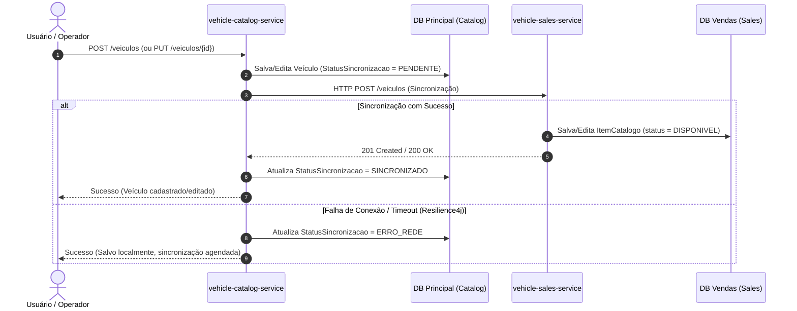
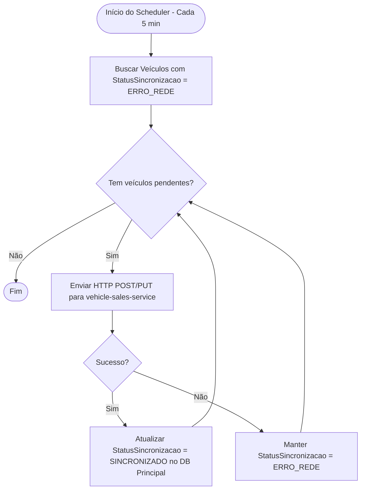
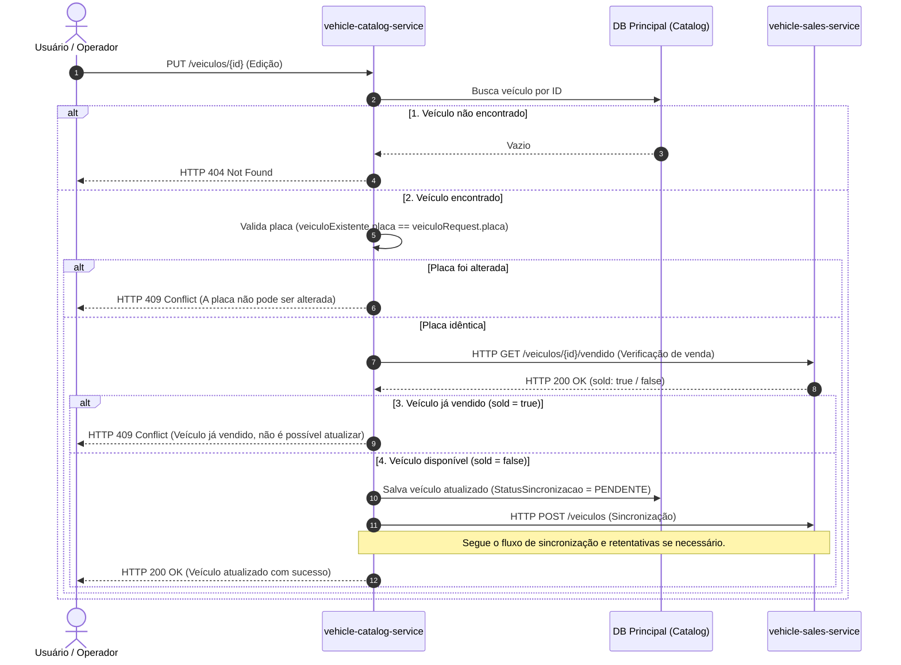
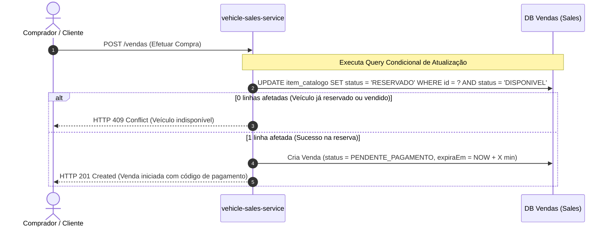
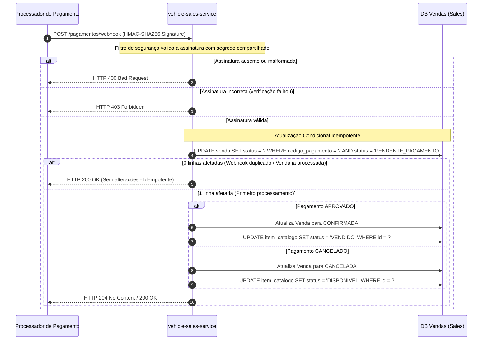
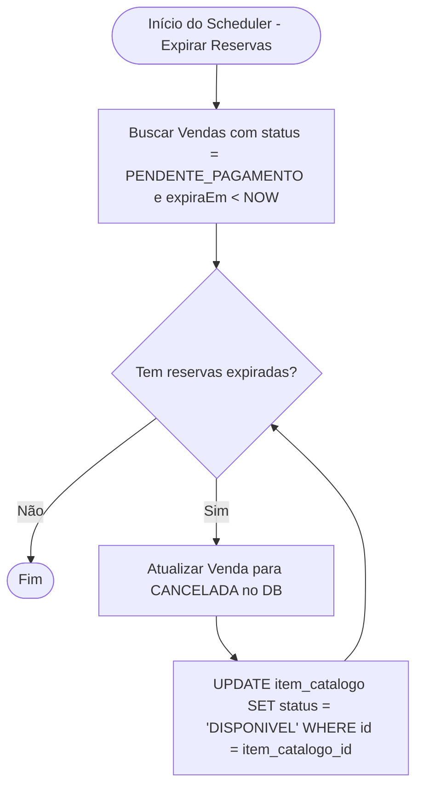

# Diagramas de Fluxo — Plataforma de Revenda de Veículos

Este documento descreve detalhadamente os fluxos de integração, sincronização de dados e processos de negócio entre os microsserviços `vehicle-catalog-service` (software principal) e `vehicle-sales-service` (serviço de vendas).

---

## 1. Cadastro, Edição e Sincronização de Veículos

Quando um veículo é cadastrado ou editado no software principal, os dados devem ser sincronizados com o serviço de vendas (réplica local). Caso ocorra uma falha de rede/integração, o sistema utiliza uma estratégia de resiliência e retentativa assíncrona.

### Diagrama de Sequência (Sincronização Inicial)

### Diagrama de Processo (Scheduler de Retentativa)

### Componentes Envolvidos
- **Controller/Adapter de Entrada**: [VeiculoAdapter](file:///home/isadmot/Github/CatalogoService/src/main/java/br/com/fiap/sout/catalogo/adapter/in/web/VeiculoAdapter.java)
- **Use Cases**: [CadastrarVeiculoUseCase](file:///home/isadmot/Github/CatalogoService/src/main/java/br/com/fiap/sout/catalogo/application/usecases/CadastrarVeiculoUseCase.java) e [AtualizarVeiculoUseCase](file:///home/isadmot/Github/CatalogoService/src/main/java/br/com/fiap/sout/catalogo/application/usecases/AtualizarVeiculoUseCase.java)
- **Porta de Saída (Sync)**: [SincronizarCatalogoPort](file:///home/isadmot/Github/CatalogoService/src/main/java/br/com/fiap/sout/catalogo/application/ports/out/SincronizarCatalogoPort.java)
- **Adapter de Integração HTTP**: [VendasVeiculoAdapterHttp](file:///home/isadmot/Github/CatalogoService/src/main/java/br/com/fiap/sout/catalogo/adapter/out/http/VendasVeiculoAdapterHttp.java)
- **Scheduler**: [VeiculoSyncScheduler](file:///home/isadmot/Github/CatalogoService/src/main/java/br/com/fiap/sout/catalogo/infra/scheduler/VeiculoSyncScheduler.java)
- **Enum de Status**: [StatusSincronizacao](file:///home/isadmot/Github/CatalogoService/src/main/java/br/com/fiap/sout/catalogo/adapter/out/persistence/enums/StatusSincronizacao.java)

---

## 2. Edição de Veículo (Validação e Bloqueio de Veículo Vendido)

Para garantir a consistência do negócio, a edição de um veículo passa por verificações rígidas de existência, imutabilidade da placa e verificação se o veículo já foi vendido.

### Diagrama de Sequência

### Componentes Envolvidos
- **Porta de Saída (Check)**: [VerificarVeiculoVendidoPort](file:///home/isadmot/Github/CatalogoService/src/main/java/br/com/fiap/sout/catalogo/application/ports/out/VerificarVeiculoVendidoPort.java)
- **Adapter de Integração HTTP**: [VendasVeiculoAdapterHttp](file:///home/isadmot/Github/CatalogoService/src/main/java/br/com/fiap/sout/catalogo/adapter/out/http/VendasVeiculoAdapterHttp.java)
- **Use Case**: [AtualizarVeiculoUseCase](file:///home/isadmot/Github/CatalogoService/src/main/java/br/com/fiap/sout/catalogo/application/usecases/AtualizarVeiculoUseCase.java)
- **Exceções de Domínio**: 
  - [VeiculoNaoEncontradoException](file:///home/isadmot/Github/CatalogoService/src/main/java/br/com/fiap/sout/catalogo/domain/exceptions/VeiculoNaoEncontradoException.java) (HTTP 404)
  - [PlacaAlteradaException](file:///home/isadmot/Github/CatalogoService/src/main/java/br/com/fiap/sout/catalogo/domain/exceptions/PlacaAlteradaException.java) (HTTP 409)
  - [VeiculoVendidoException](file:///home/isadmot/Github/CatalogoService/src/main/java/br/com/fiap/sout/catalogo/domain/exceptions/VeiculoVendidoException.java) (HTTP 409)

---

## 3. Fluxo de Compra e Reserva do Veículo

Sob pico de tráfego, múltiplos clientes podem tentar comprar o mesmo veículo ao mesmo tempo. Para evitar concorrência nociva, é feito um update condicional atômico na base de dados de vendas.

### Diagrama de Sequência

### Componentes Envolvidos
- **Concorrência**: Implementado via query com `@Modifying` e `@Query` no repositório de vendas:
  `UPDATE ItemCatalogoEntity i SET i.status = 'RESERVADO' WHERE i.id = :id AND i.status = 'DISPONIVEL'`
- **Controller/Adapter de Entrada**: `VendaAdapter` (Sales Service)
- **Use Case**: `EfetuarVendaUseCase` (Sales Service)

---

## 4. Webhook de Pagamento (Idempotência e Segurança)

O webhook é o endpoint chamado pela processadora de pagamentos externa. O fluxo deve validar a assinatura HMAC-SHA256 para garantir autenticidade e processar o pagamento de forma idempotente.

### Diagrama de Sequência

### Componentes Envolvidos
- **Segurança**: Filtro HTTP dedicado no `vehicle-sales-service` que calcula e valida o HMAC-SHA256 do corpo da requisição.
- **Idempotência**: Garantida pela restrição `WHERE status = 'PENDENTE_PAGAMENTO'` na query de atualização da venda.

---

## 5. Expiração de Reserva Órfã (Clean Up)

Se o comprador iniciar uma venda, o veículo for reservado, mas o webhook de pagamento nunca chegar (ou o cliente desistir), a reserva ficará órfã. Um scheduler monitora e limpa essas reservas expiradas.

### Diagrama de Processo

### Componentes Envolvidos
- **Scheduler**: `@Scheduled` no `vehicle-sales-service`.
- **Use Case**: `ExpirarReservasUseCase` (Sales Service).
